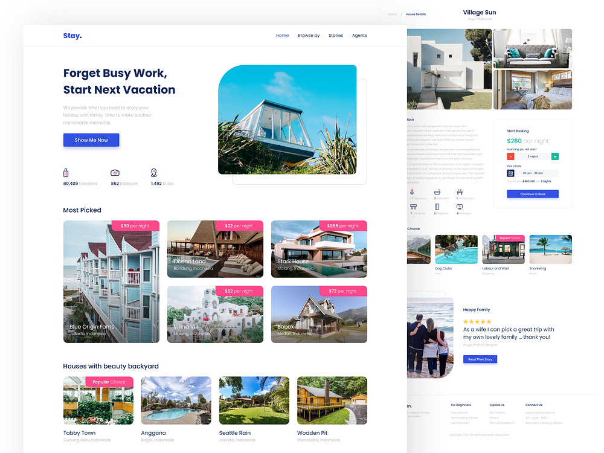
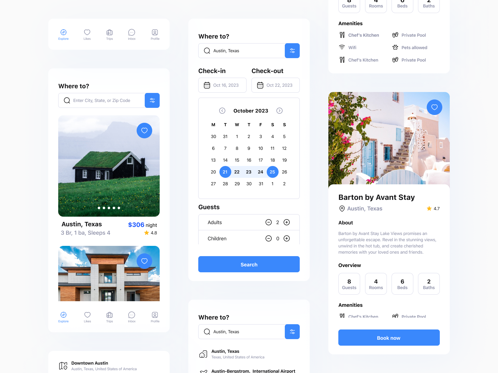
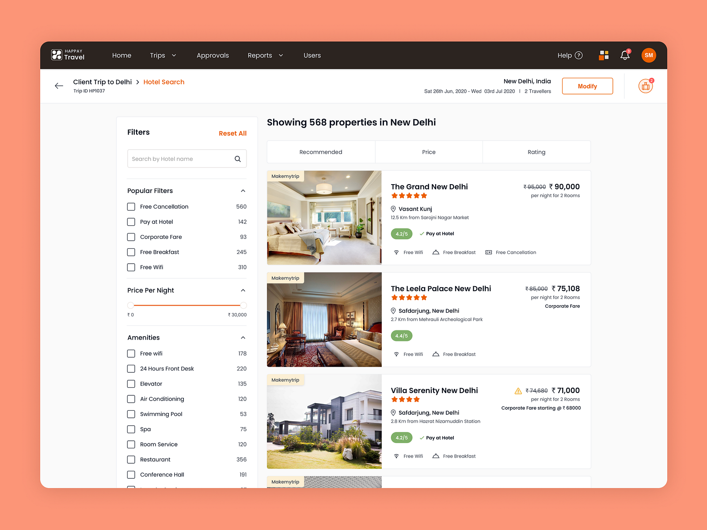

import ContentCountdownWrapper from "@site/src/components/ContentCountdownWrapper/ContentCountdownWrapper";

Individuella uppgiften är för de som siktar mot VG. Här ska ni implementera utökade krav för att få VG.

<ContentCountdownWrapper datetime="2025-08-25T09:00:00Z">
### **Bnb-hanteringsapplikation (liknande Airbnb)**

**Deadline för inlämning:** 7 november

**Presentationsdatum:** 8 november

Er uppgift är att bygga en Bnb-hanteringsapplikation där användare kan hantera Bnb-bokningar. Applikationen ska använda **Next.js** med **TypeScript** för backend och koppla mot **MongoDB** eller en likvärdig databas. Frontend rekomenderas att det byggs i **next.js** men kan byggas inom **React-ekosystemet (React/Vite osv.)**.

**Modeller**:

1. **User**: Hanterar användarregistrering och autentisering.
    - Fält: id, namn, e-post, lösenord, isAdmin
2. **Property/Listing**: Representerar en Bnb-egendom.
    - Fält: id, namn, beskrivning, plats, pris per natt, tillgänglighet
3. **Booking**: Representerar en bokning gjord av en kund.
    - Fält: id, skapad_datum, incheckning_datum, utcheckning_datum, total_pris
    - nested: user (se ovan)
    - Referenser: skapad_av: user, egendom: property

<aside>
💡 Vissa fält kan ändras eller läggas till om ni har en bra motivering för det.

</aside>

### **Specifikationer:**

1. **Backend:**
    - TypeScript
    - Implementera CRUD-operationer för Property.
    - Implementera användarregistrering och autentisering med JWT.
    - Implementera CRUD-operationer för Booking.
    - Beräkna totalpris vid bokning baserat på pris per natt och vistelselängd.
2. **Frontend**:
    - TypeScript
    - Skapa enkla sidor för att:
        - Registrera och logga in användare.
        - Skapa, läsa, uppdatera och radera properties.
        - Göra och visa bokningar.
        - Design är valfri; fokusera på funktionalitet snarare än styling.
3. **Examinationsform**:
    - Studenterna lämnar in projektet med källkod och instruktioner för hur man kör applikationen.
    - Studenterna redovisar genom att demonstrera funktionaliteten och förklara viktiga designbeslut och implementationer. Detta ska ske via en muntlig presentation.

### **Betygskriterier:**

- **Godkänd (G)**:
    - Grundläggande funktionalitet för `CRUD-operationer` för `Property` fungerar korrekt.
    - Hantering av `Properties` där manipulering av egendomar så som **(POST, PUT och DELETE)** kan endast göras av en inloggad användare.
    - `API-rutter` är korrekt implementerade och svarar som förväntat.
    - Redovisat fungerande funktionalitet med en sammanhängande front och backend.
    - Enkel autentisering är implementerad.
    - All backend ska vara **typad**. Detta innebär att man i största mån undviker att typecasta till `any` och liknande genvägar.
- **Väl Godkänd (VG)**: **Minst 2 av nedan ska ha uppfyltlts**
    - **Booking (lätt):** Bokningar kan endast skapas av en inloggad användare och innehåller användaruppgifter (se ovan) och `property`. Totalpriset beräknas baserat på pris per natt och vistelselängd.
    - **Property/Listing (medel):**  Listings ska endast kunnas ta bort uppdateras av den som skapade dem dock så ska det vara möjligt för en (admin) att ta bort dem.
    - **ListingAgent (svårare):** Utveckling på booking flödet som ser ena parten som `user` och andra som `ListingAgent` där `ListingAgent` måste godta bokningen och innan dess så har bokningen en `pending` status. Godtas den så blir `Booking` status `accepted` annars `rejected`
    
    ### Valfri design men det ska vara tydligt vad hemsidan används för:
    
    
    
    
    Lägg ribban där det känns lämpligt men lägg störst fokus på funktionalitet.

</ContentCountdownWrapper>